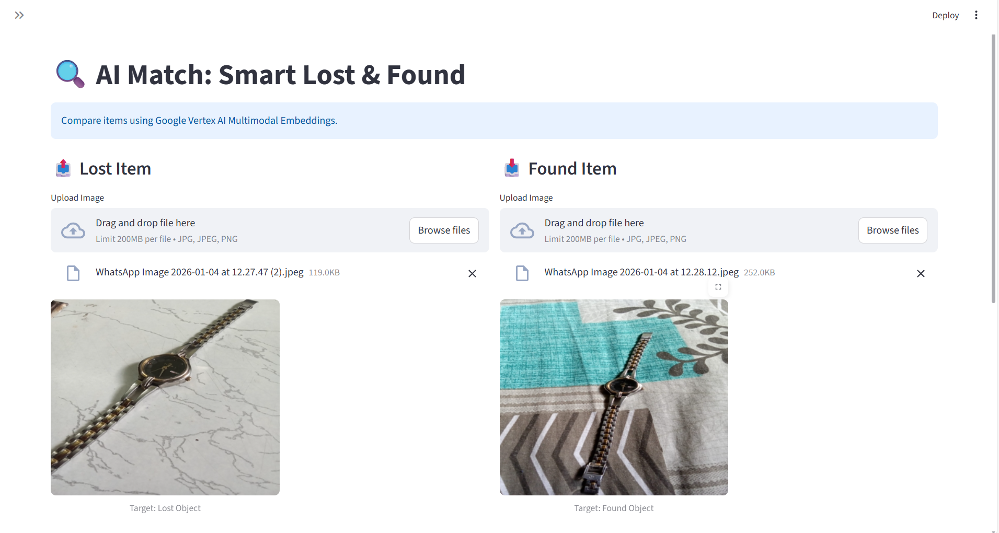
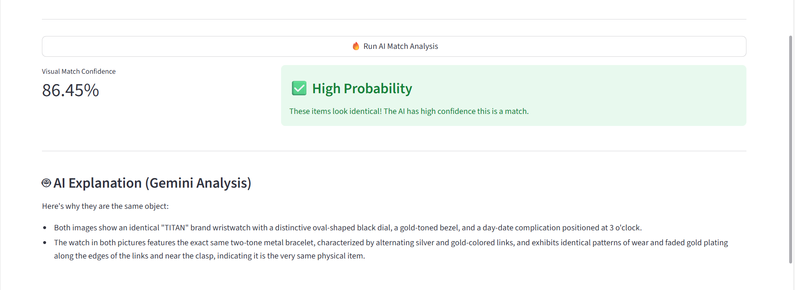

# 🔍 SmartFind AI: Lost & Found Reimagined
# 🔍 SmartFind AI: Lost & Found Reimagined
**Bridging the gap between lost and found using Google Vertex AI Multimodal Embeddings.**

---

## 📖 Overview
Finding a lost item in a sea of reports is a needle-in-a-haystack problem. Traditional systems rely on text tags like "blue watch," which are often too vague. **SmartFind AI** uses computer vision to "mathematically see" the item. By comparing the visual vectors of a lost item photo and a found item photo, we can provide a high-confidence match in seconds.

## 🚀 Core Features
- **Visual Vector Matching:** Uses Google’s `multimodalembedding` model to create 1408-dimension vectors for every image.
- **Semantic Reasoning:** Powered by **Gemini 2.5 Flash**, the app doesn't just give a score; it explains *why* the items match (e.g., "Both watches feature a distinctive circular dial with a brown leather strap").
- **Real-time Similarity Scoring:** Calculates Cosine Similarity between images to provide a confidence percentage.
- **Dynamic UI:** A clean Streamlit interface with color-coded status alerts (Green/Yellow/Red) based on match probability.

## 🛠️ Technical Stack
- **AI/ML:** Google Vertex AI (Multimodal Embeddings & Gemini 2.5 Flash)
- **Frontend:** Streamlit
- **Language:** Python 3.9+
- **Math Logic:** NumPy & Scikit-learn (Cosine Similarity)

## 🏗️ Architecture
1. **Embedding Layer:** Input images are sent to Vertex AI to be converted into numerical tensors.
2. **Comparison Layer:** Scikit-learn calculates the distance between these tensors.
3. **Logic Layer:** If the similarity is high, the images are sent to Gemini for a descriptive verification report.
4. **Display Layer:** Streamlit renders the results, previews the images, and shows the AI reasoning.


## 🛠️ Installation & Setup

1. **Clone the repo:**
   ```bash
   git clone [https://github.com/your-username/smart-find-ai.git](https://github.com/your-username/smart-find-ai.git)
   cd smart-find-ai

   Install dependencies:

pip install streamlit google-cloud-aiplatform numpy scikit-learn Pillow

Google Cloud Credentials: Place your Google Cloud Service Account key in the root folder and name it key.json. (Ensure this file is listed in your .gitignore!)

Run the app:

streamlit run app.py

🛡️ Privacy & Security:

This project uses .gitignore to ensure that no sensitive Google Cloud API keys or temporary user uploads are ever pushed to the public repository.